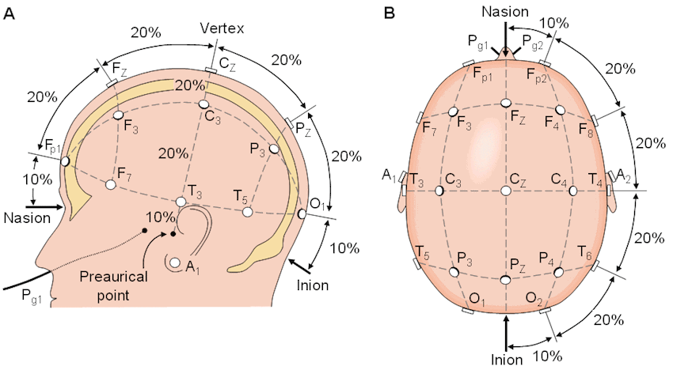

# 2026 Vanderbilt BrainHack Project: Enlightening the Emotional Brain

## Digitization and Co-registration

### Why do we perform co-registration?

- In many fNIRS studies, people make optode-anatomy associations based on a standardized template, such as the MNI space.
- But everyone's head differs in size, shape, etc. 
    - Even when using the same cap, the same optodes may be covering different, adjacent brain regions.
    - This problem is more severe if the cap size does not align with one's head circumference. This is quite common in fNIRS studies. Many labs have 2-3 caps ready to go, but very often participants' head sizes go beyond the size range. Unlike EEG, it is usually very costly to have many fNIRS caps of different sizes set-up at the same time.
- Therefore, to make appropriate interpretations, we should know how much the optodes on a given participant's head deviate from the underlying anatomy, based on a standardized template. You could also think of this process as normalizing the coordinates. 

### How are we currently doing it?

- We are currently using [Structure Sensor III](https://structure.io/?gad_source=1&gad_campaignid=22794124010&gbraid=0AAAAA9c7Ky4hqyHtVNQJ-jQBlpQJvrkzU&gclid=CjwKCAjw7p_UBhBlEiwAhpIs75k6WOIF8CXM4O9HWXP_G1X0QeqBqN_Y8tBVCj1J-EYpxG_nrf1HQxoCMYIQAvD_BwE). It is a 3D body scanner built for healthcare professionals. It projects an invisible infrared dot pattern onto objects and uses synchronized cameras to measure how the pattern warps. The output file format is currently .obj. These files can be found [here](https://vanderbilt365-my.sharepoint.com/:f:/g/personal/haiping_huang_vanderbilt_edu/IgCcFO1ZM24QQ7hXgy4C2fDQAaldcm64un7yAAWXytMsNA4?e=EcfHeE)
- We are currently using the [FieldTrip toolbox](https://www.fieldtriptoolbox.org/) for co-registration. Workflow example may be found [here](https://www.fieldtriptoolbox.org/tutorial/source/electrode/) 

### How you can contribute:

 
image source: Shriram, R., Sundhararajan, M., & Daimiwal, N. (2013). EEG based cognitive workload assessment for maximum efficiency. Int. Organ. Sci. Res. IOSR, 7, 34-38.

-  Unlike many EEG caps, our fNIRS cap is black and opaque. Therefore, once the cap is placed, important scalp locations may be difficult to identify in a 3D scan.  Cz and Iz are especially challenging, when participant head geometry does not follow the standardized cap. 
    - #### **Task #01: Design or identify a small physical marker that can be placed at Cz and Iz, and be visible post cap placement. This marker should be reliably recognized in scans acquired with the Structure Sensor**. 
      - The effective marker should be:
         - Clearly visible in the Structure Sensor’s 3D mesh and/or color image.
         - Distinguishable from the cap, hair, optodes, and surrounding objects.
         - Small, lightweight, safe, and comfortable for participants.
         - Easy to position and securely attach.
         - Stable throughout the scanning process.
         - Compatible with different hair types and cap placements.
         - Unlikely to interfere with the fNIRS optodes or measurements.
         - Inexpensive and easy for other laboratories to reproduce.
         - Designed so that its precise center or reference point can be identified.
    - #### **Task #02: Develop code to estimate Cz location for each participant**.
      - FieldTrip may have some code that estimates Cz based on other available fiducials. An alternative I have not investigated is [Cedalion](http://cedalion.tools/) in Python.
      - We provide Structure Sensor and fNIRS cap at the BrainHack event to help you experiment.
- Manually labelling optodes can be tedious. Given that spatial relationships among optodes exist in NIRx recording files and can be extracted. We also have a 2D montage 10-20 layout.
    - #### **Task #03: Develop code to automate optode labeling.**
    - #### **Task #04: Develop code to project individual's optode coordinates to MNI space and show deviations in an output file**
    - #### **Task #05: Develop code to query an anatomical atlas and get channel-specific cortical regions**

