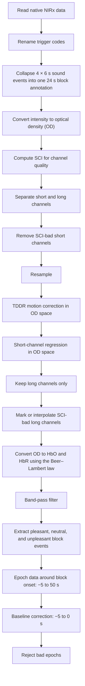

# 2026 Vanderbilt BrainHack Project: Enlightening the Emotional Brain
## Preprocessing and quality check
### Why preprocess?
- Separating cortical response from noise and physiological confounds.
  - Although fNIRS is sensitive to cortical changes in oxygenated and deoxygenated hemoglobin, the recorded signal is not exclusively cerebral. Near-infrared light travels through the scalp and skull before reaching the cortex, so measurements contain a mixture of task-evoked neural hemodynamics, superficial blood-flow changes, systemic physiology, motion artifacts, instrumental noise, and spontaneous cerebral activity. Some confounding components may also be time-locked to the experimental task, causing them to resemble genuine cortical activation or obscure an underlying neural response. Consequently, careful preprocessing and statistical modeling—including signal-quality assessment, motion correction, short-separation regression, and nuisance regressors within a general linear model—are necessary to isolate the task-related cerebral response and reduce the risk of false-positive or false-negative conclusions.
  - Helpful readings:
    - [Tachtsidis, I., & Scholkmann, F. (2016). False positives and false negatives in functional near-infrared spectroscopy: issues, challenges, and the way forward. Neurophotonics, 3(3), 031405-031405.](https://www.spiedigitallibrary.org/journals/neurophotonics/volume-3/issue-3/031405/False-positives-and-false-negatives-in-functional-near-infrared-spectroscopy/10.1117/1.NPh.3.3.031405.short)
    - [Yücel, M. A., Lühmann, A. V., Scholkmann, F., Gervain, J., Dan, I., Ayaz, H., ... & Wolf, M. (2021). Best practices for fNIRS publications. Neurophotonics, 8(1), 012101-012101.](https://www.spiedigitallibrary.org/journals/neurophotonics/volume-8/issue-01/012101/Best-practices-for-fNIRS-publications/10.1117/1.NPh.8.1.012101.full)

### How are we currently doing it?

#### Waveform averaging - adapted from MNE-NIRS analysis example [here](https://mne.tools/mne-nirs/stable/auto_examples/general/plot_15_waveform.html)

 

- Data Cleaning & Quality Check: 
  - Check annotations/trigger events.
  - Convert raw light intensity values to optical density values. This procedure removes baseline variations in light levels and scales the data linearly so that subsequent application of the modified Beer-Lambert law can accurately yield relative hemoglobin concentrations (HbO / HbR) 
  - Inspection of data quality. Evaluate bad channels using Scalp Coupling Index (SCI) and generate histogram showing counts of bad channels. A SCI cutoff of 0.5-0.7 is often used in the literature.
  - Exclude bad channels.
- Signal Preprocessing & Visualization:
  - Remove motion artefacts. Example [here](https://mne.tools/mne-nirs/stable/auto_examples/general/plot_21_artifacts.html)
  - Convert optical density values to hemoglobin values, using the modified Beer-Lambert Law.
  - Remove heart rate low-frequency non-physiological drifts. 
  - If using GLM, we apply short-channel regression. A full GLM example can be found [here](https://mne.tools/mne-nirs/stable/auto_examples/general/plot_11_hrf_measured.html)

### How you can contribute:
  - #### **Issue #06: Develope your own preprocessing pipeline for the current experiment, or refine our pipeline.**
    - What do you think of this preprocessing pipeline in general? Feedback is particularly appreciated from team members with signal processing and/or neuroimaging background.